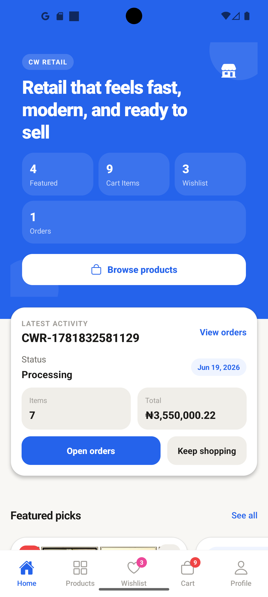
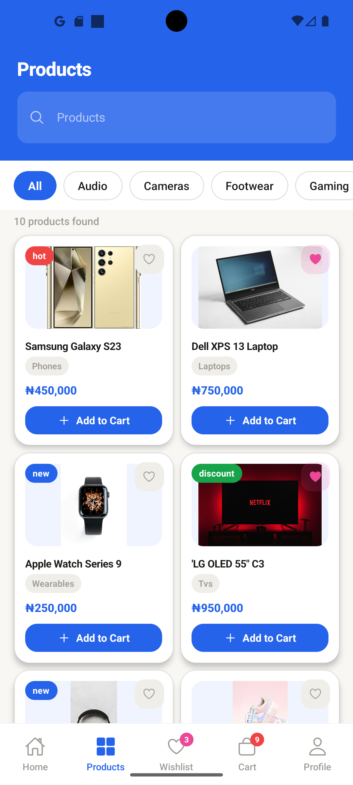
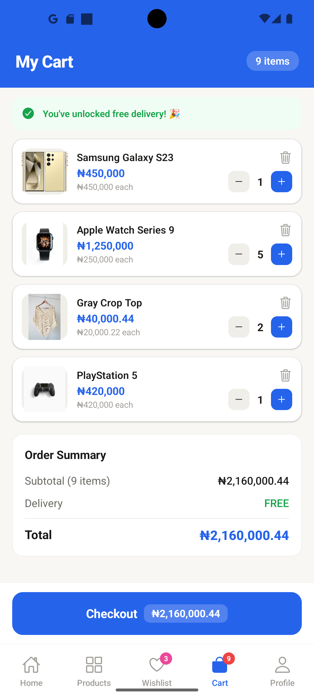
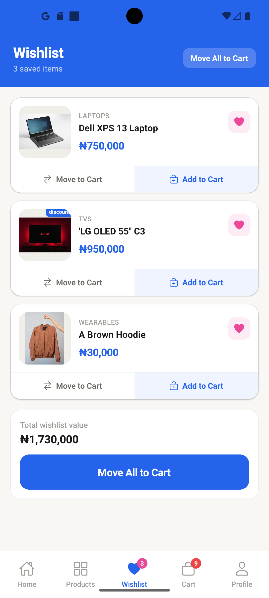
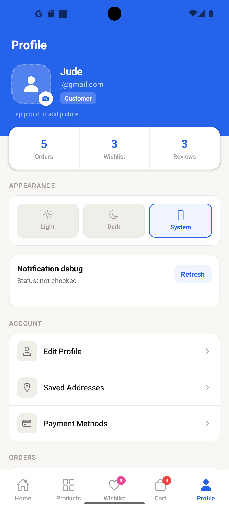

# EasyShop POS

EasyShop POS is an Expo React Native shopping app for browsing live products, managing a cart and wishlist, checking out, and syncing customer data with a Strapi backend. The app uses Firebase Authentication for account identity, Strapi for catalog and customer records, and local storage for a smoother mobile experience.

## Highlights

- Firebase email/password and Google sign-in
- Persistent auth session with a startup session check
- Live products, categories, and featured products from Strapi
- Automatic catalog retries, request deduplication, and five-minute in-memory caching
- Product detail pages with stock, pricing, badges, and images
- Cart, wishlist, Paystack test checkout, and order success flows
- Server-side Paystack initialization and payment verification
- Saved addresses and order history synced to Strapi
- Profile data synced between Firebase and Strapi
- Expo push notification setup with Android notification channel
- Dark and light theme support
- Bottom tab navigation that hides while scrolling
- Local persistence for cart, wishlist, orders, addresses, and profile cache

## Screenshots

<p>
  
  
  
</p>

<p>
  
  
  
</p>

## Tech Stack

- Expo SDK 54
- React Native 0.81
- Expo Router
- Firebase Authentication
- React Native Firebase
- Google Sign-In
- Strapi 5
- Paystack
- Expo Notifications
- AsyncStorage
- Jest for tests

## Architecture

```text
Strapi Admin -> Strapi API -> Expo Mobile App
                    |              |
                    |              +-> Firebase Auth
                    |              +-> AsyncStorage cache
                    |
                    +-> Paystack API
                    +-> PostgreSQL-ready data layer
```

- Strapi manages products, categories, profiles, saved addresses, and orders.
- Firebase owns authentication and restores the signed-in user on app launch.
- Firebase session readiness does not wait for slower profile or notification work.
- Catalog requests retry transient failures automatically and share fresh results between Home and Products.
- Paystack secret-key operations run in Strapi; the mobile app never contains the secret key.
- Expo Notifications registers push tokens and stores them on user profiles.

## Project Structure

- `app/` - Expo Router routes and screens
- `components/` - reusable UI and flow components
- `context/` - app state providers for profile, cart, wishlist, orders, addresses, and theme
- `constants/` - shared product types and helpers
- `lib/` - Strapi, Firebase token, persistence, notification, and API helpers
- `assets/` - app images, icons, and screenshots
- `my-strapi-project/` - local Strapi backend project

## Getting Started

### 1. Install Dependencies

```bash
npm install
```

### 2. Configure Environment Variables

Create a `.env` file in the Expo project root:

```env
EXPO_PUBLIC_GOOGLE_WEB_CLIENT_ID=your_google_web_client_id
EXPO_PUBLIC_STRAPI_URL=https://your-strapi-url.com
```

For local Strapi on an Android emulator:

```env
EXPO_PUBLIC_STRAPI_URL=http://10.0.2.2:1337
```

For a physical device, use your computer's LAN IP instead of `localhost`.

Configure the Paystack secret key in the Strapi backend environment, never in the Expo app:

```env
PAYSTACK_SECRET_KEY=sk_test_your_paystack_test_secret
```

### 3. Start the App in Development

This app uses native modules such as Firebase, Google Sign-In, and notifications, so development testing should use a custom Expo development client.

Build the development APK:

```bash
eas build --profile development --platform android --clear-cache
```

Install the APK on your device, then start Metro:

```bash
npx expo start --dev-client -c
```

### 4. Build a Preview APK

Use preview when you want to test the app like a real installed app without Metro:

```bash
eas build --profile preview --platform android --clear-cache
```

## Available Scripts

```bash
npm run lint
npm test
npm run web
npm run android
npm run ios
```

## Strapi Collections

Create these Strapi collections:

- `categories`
- `products`
- `profiles`
- `saved-addresses`
- `orders`

Recommended `products` fields:

- `name`
- `description`
- `price`
- `image`
- `badge`
- `isFeatured`
- `stock`
- `category` relation

Recommended `profiles` fields:

- `firebaseUid`
- `firstName`
- `lastName`
- `email`
- `phone`
- `address`
- `dob`
- `avatarUrl`
- `expoPushToken`

Recommended `saved-addresses` fields:

- `firebaseUid`
- `label`
- `name`
- `street`
- `city`
- `state`
- `phone`
- `isDefault`

Recommended `orders` fields:

- `firebaseUid`
- `orderNumber`
- `status`
- `items`
- `subtotal`
- `delivery`
- `paymentMethod`
- `address`

## Payments

Card checkout uses Paystack test mode:

1. The mobile app asks Strapi to initialize a transaction.
2. Strapi calls Paystack using the backend-only secret key.
3. The app opens Paystack's hosted checkout.
4. After authentication, the app verifies the reference through Strapi.
5. An order is recorded only after Paystack confirms the payment and amount.
6. The cart clears and the Order Success screen opens immediately after the order is recorded.


## Firebase Setup

The app expects Firebase Authentication to be configured for:

- Email/password sign-in
- Google sign-in

Android builds use:

```text
google-services.json
```

iOS builds use:

```text
GoogleService-Info.plist
```

## Notifications

The app requests notification permission after login, creates an Android `orders` channel, generates an Expo push token, and saves the token to the user's Strapi profile when available.

In development, the Profile screen shows a notification debug card with the current permission status and Expo push token.

## Quality Checks

Run these before sharing a build:

```bash
npx tsc --noEmit
npm run lint
npm test
```

## Portfolio Notes

This project demonstrates:

- Mobile app routing with Expo Router
- Auth restoration and protected app navigation
- Real CMS/API integration
- Local persistence plus backend sync
- Backend-verified hosted payments
- Resilient catalog loading with retry and cache behavior
- Reusable component architecture
- Push notification setup
- Theme-aware UI
- A complete shopping flow from browsing to checkout

## Future Improvements

- Admin analytics dashboard
- Production Paystack keys, webhooks, and server-side payment reconciliation
- Order tracking updates from backend status changes


## License

This project is for learning and portfolio use.
